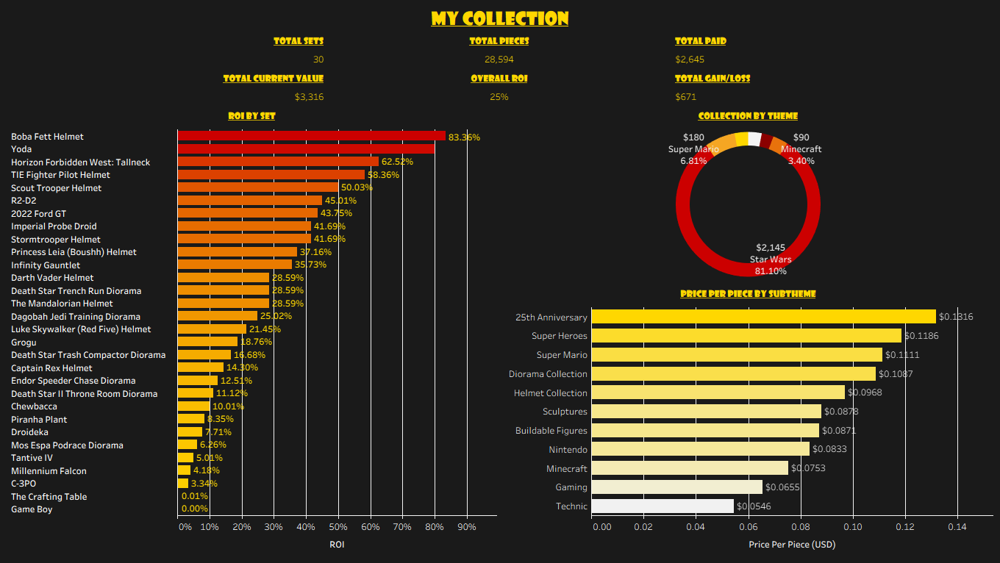
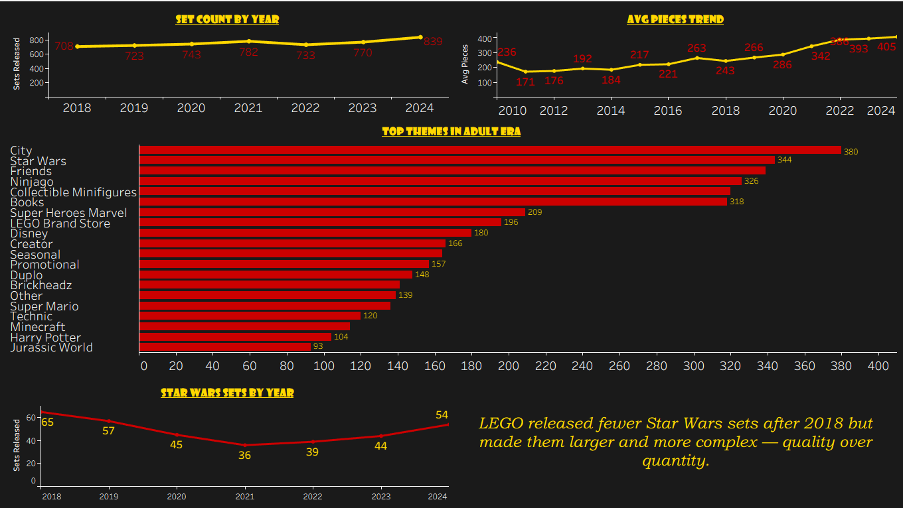
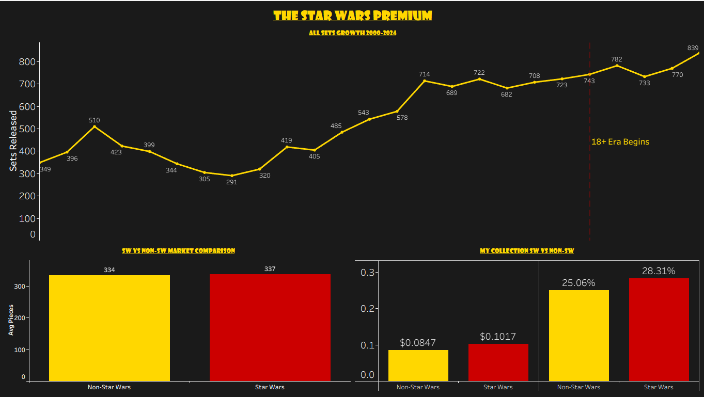

# 🧱 Built for Adults, Shared with Everyone: A LEGO Data Analysis

**Tools: Python · SQL · SQLite · Tableau**

What started as a shelf full of Star Wars sets became a data project exploring one of the greatest corporate turnarounds in toy history. This analysis combines Rebrickable's full LEGO catalog (19,858 sets), my personal collection of 30 adult-targeted sets, and LEGO's publicly available financial data to tell the story of how a nearly bankrupt toy company reinvented itself by building for grown-ups.

---

## 📊 Dashboards

**[View on Tableau Public →](https://public.tableau.com/app/profile/bryce.gardner/viz/LegoSpendingCompanyAnalysis/BuiltforAdultsSharedwithEveryone)**

### Dashboard 1 — My Collection


### Dashboard 2 — The 18+ Era


### Dashboard 3 — The Star Wars Premium


---

## 🔍 Key Findings

- **25.4% overall ROI** across 30 sets valued at $3,316 against $2,645 paid
- **Boba Fett Helmet (83.4%)** and **Yoda (80.0%)** are the top performers — both retired sets with strong collector demand
- **Average pieces per set nearly doubled** from 236 in 2010 to 405 in 2024, driven by the adult-targeted product line
- **Star Wars sets cost $0.1017 per piece** vs $0.0847 for non-Star Wars — a ~20% licensed premium
- **Star Wars delivers higher ROI (28.3%)** than non-Star Wars sets (25.1%) in my personal collection
- LEGO released its **record 839 sets in 2024** while the overall toy market declined 1%
- The 25th Anniversary subtheme has the **highest price per piece ($0.1316)** — LEGO charging a premium for nostalgia
- **Technic is the best value** at $0.0546 per piece — the Ford GT delivered 43.75% ROI on an $80 sale purchase

---

## 🗂️ Project Structure

```
lego-spending-company-analysis/
│
├── csv/
│   ├── sets.csv                          # Rebrickable full catalog
│   ├── themes.csv                        # Rebrickable theme lookup
│   ├── bryce_lego_collection.csv         # Personal inventory (30 sets)
│   ├── q1_roi_by_set.csv
│   ├── q2_roi_by_subtheme.csv
│   ├── q3_collection_summary.csv
│   ├── q4_collection_by_theme.csv
│   ├── q5_price_per_piece_by_subtheme.csv
│   ├── q6_adult_sets_by_year.csv
│   ├── q7_adult_sets_by_theme.csv
│   ├── q8_avg_pieces_trend.csv
│   ├── q9_starwars_vs_nonstarwars.csv
│   ├── q10_starwars_sets_by_year.csv
│   ├── q11_my_starwars_vs_nonstarwars.csv
│   └── q12_all_sets_growth.csv
│
├── lego_etl.py                           # Extract, Transform, Load pipeline
├── lego_queries.sql                      # All 12 analytical queries
├── lego.db                               # SQLite database
└── README.md
```

---

## 🛠️ How It Was Built

### 1. Data Sources
- **[Rebrickable](https://rebrickable.com/downloads/)** — sets.csv and themes.csv (19,858 sets, 494 themes)
- **Brickset / BrickEconomy** — retail prices and current resale values
- **Personal inventory** — 30 sets identified from shelf photos, manually verified against Brickset set numbers

### 2. ETL Pipeline (`lego_etl.py`)
- Ingested Rebrickable CSVs and personal collection data
- Joined theme names onto set records using parent_id lookup
- Calculated ROI, gain/loss, and price-per-piece for all personal collection sets
- Flagged adult era sets (2018+) for segmented analysis
- Loaded 4 tables into SQLite: `all_sets`, `themes`, `my_collection`, `adult_sets`

### 3. SQL Analysis (`lego_queries.sql`)
12 queries covering:
- Personal collection ROI ranked by set and subtheme
- Collection summary KPIs
- Price per piece by subtheme
- Adult-era set count and piece count trends (2018–2024)
- Top 20 themes by volume in the adult era
- Star Wars vs non-Star Wars piece count and pricing comparison
- Full catalog growth 2000–2024

### 4. Visualization (Tableau Public)
Three dashboards published as a Tableau Story:
- **My Collection** — KPI tiles, ROI by set, theme breakdown donut, price per piece by subtheme
- **The 18+ Era** — set count trend, complexity trend, top themes, Star Wars volume by year
- **The Star Wars Premium** — full catalog growth with 18+ reference line, SW vs non-SW market and personal comparison

---

## 📋 Data Notes

- **Current resale values** sourced from BrickEconomy during June 2025; values fluctuate with market demand and retirement status
- **Price paid** reflects retail MSRP for gifted sets; the 2022 Ford GT (42154) was purchased on sale at $80
- **Yoda (75255) and Grogu (75318)** predate the official 18+ label (launched 2020) but are included as adult-targeted collector sets
- **Year purchased** approximated as year of release for gifted sets, which reflects the collection's buying pattern accurately
- Raw Rebrickable source files not included per data redistribution guidelines; download directly from rebrickable.com/downloads

---

## 🔗 Connect

If you enjoy data projects built from real life, check out my TCG Spending & Collection Analysis for a similar deep dive into Pokémon card collecting.

| | |
|---|---|
| 💼 **LinkedIn** | [linkedin.com/in/bryce-gardner-16a889183](https://www.linkedin.com/in/bryce-gardner-16a889183) |
| 🐙 **GitHub** | [github.com/brycegardner90](https://github.com/brycegardner90) |
| 📊 **Tableau Public** | [public.tableau.com/app/profile/bryce.gardner](https://public.tableau.com/app/profile/bryce.gardner) |
| 🃏 **TCG Project** | [github.com/brycegardner90/tcg-spending-collection-analysis](https://github.com/brycegardner90/tcg-spending-collection-analysis) |
